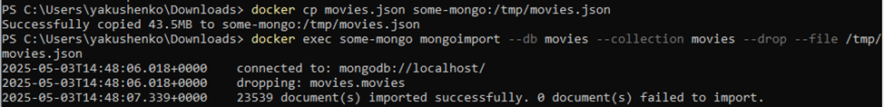
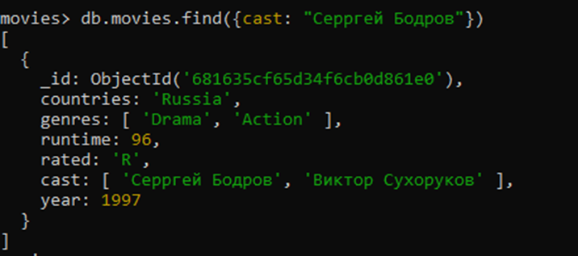

Цель:
В результате выполнения ДЗ вы научитесь разворачивать MongoDB, заполнять данными и делать запросы.

Описание/Пошаговая инструкция выполнения домашнего задания:
Необходимо:

установить MongoDB одним из способов: ВМ, докер;
заполнить данными;
написать несколько запросов на выборку и обновление данных

Отчёт
1. Скачивание и создание контейнера с монго: docker run --name some-mongo -p 27017:27017 -d mongo:latest

2. Подключение к бд через командную строку: docker exec -it some-mongo mongosh

3. Показать все базы данных: show dbs

4.	Создание БД фильмов:
      А.  Скачивание джейсона: https://github.com/neelabalan/mongodb-sample-dataset/blob/main/sample_mflix/movies.json
      Б. Копирование его во временную папку в контейнере: docker cp movies.json some-mongo:/tmp/movies.json
      В. Создание новой БД: docker exec some-mongo mongoimport --db movies --collection movies --drop --file /tmp/movies.json

5.	Переход в созданную базу: use movies
6.	Посмотреть доступные коллекции: show collections

7.	Посмотреть данные в коллекции фильмов: db.movies.find()
8.	Выбрать все фильмы 1986 года db.movies.find({ year: {$in: [1986]}})
9.	Выбрать все испанские фильмы старше 1986 года: db.movies.find({$and: [{ year: { $gte: 1986} }, {countries: "Spain"}]})

10.	Добавить отечественный фильм: db.movies.insertOne({countries: 'Russia', genres: ['Drama', 'Action'], runtime: 96, rated: 'R', cast: ['Серргей Бодров', 'Виктор Сухоруков'], year: 1997})

11.	Проверка, что фильм добавился: db.movies.find({cast: "Серргей Бодров"})

12.	Исправляем ошибку: db.movies.updateOne({cast: "Серргей Бодров"}, {$set: {cast: ['Сергей Бодров', 'Виктор Сухоруков']}})

13.	Проверяем что исправилось: db.movies.find({cast: "Сергей Бодров"})
